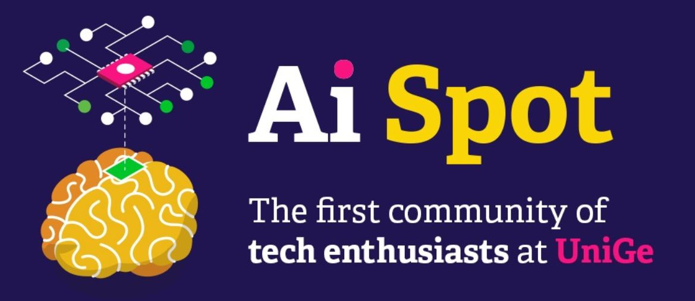

# AI Spot

**The first community of tech enthusiasts at UniGe (from Fall 2021)**

AI Spot is an upcoming initiative at UniGe for the students, by the students, established with community-driven goals to foster innovation and cultivate a technical society to share, create, and engage like-minded and passionate people.

Our prime objective is to create a network of independent thinkers to help nurture and encourage ground-level discussions to assist our community in being informed technologically and updated with state-of-the-art advancements, with a special emphasis around artificial intelligence. We plan to establish interesting and new ways to empower, explore, and develop a knowledge-first network.

With this, we anticipate creating a five-pronged cross-over between:

1. Students
2. Industry
3. Subject matter experts
4. Specialist groups
5. Academicians

Our tentative agenda includes two different tracks:
- **Technical activities**  
Open to any motivated student enrolled at UniGe (with the possibility of deducting AUK credits), with the aim of learning state-of-the-art technologies for the next generation of intelligent machines;

- **Dissemination**  
Open to everyone, with the aim of popularizing hot topics and important news about technologies and AI.

Here is the list of some of the possibile events:

|**Workshops**|**Film screenings**|**Competitions**|**Interactive media**|
|---|---|---|---|
|Reinforcement learning w/ JAX|Coded Bias (2020)|TEDx-like talks|Keynote sessions|
|Analytics w/ Tableau|AlphaGo (2017)|Local hackathons|Tech podcasts|
|Mobile-centered ML w/ TFLite on Flutter|Iperconnessi (2018)|Kaggle challenges|Virtual meetups|
|||Open debates|Industry fairs|
|...|...|...|...|

Contact the AI Spot team at [unige.ai@gmail.com](mailto:unige.ai@gmail.com)
